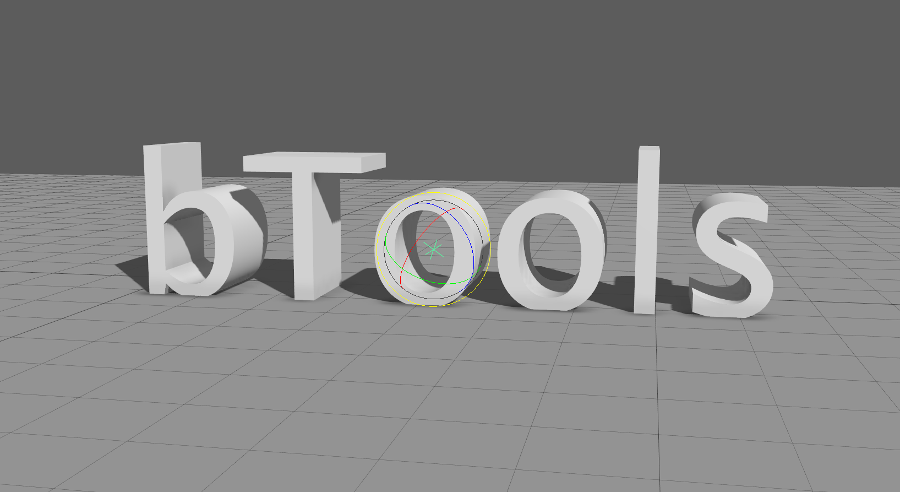

# bTools
Richard Brenick Maya Tools Module

# Install

<pre>
1. Download this package and unzip it in a good location 
    1.B (or git clone it directly if you have git installed)
2. Run installer.bat (will walk you through some options for install)
3. Restart Maya
</pre>

# tool locations

